---
© 2026 Suhwan Cha and contributors. All rights reserved.

The ideas, system design, architecture, data structures, prompts, and methodologies described in this document are proprietary intellectual property.

Unauthorized use for academic research, publications, commercial products, or derivative works is strictly prohibited without explicit written permission.
---

# DineSpot — COMET UML

> COMET (Concurrent Object Modeling and design mEThod)
> Date: 2026-03-24

---

## 1. Use Case Diagram

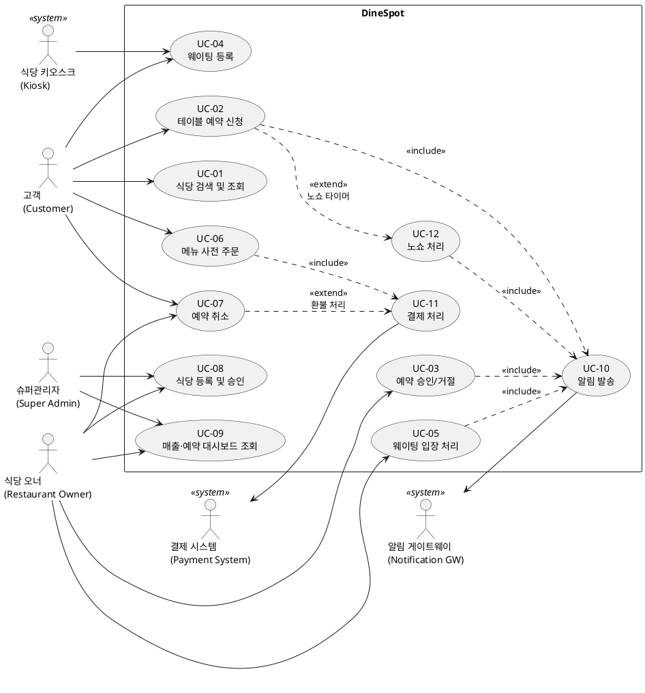

---

## 2. 객체 구조 모델 (Object Structure — COMET Entity/Boundary/Control)

COMET은 각 Use Case의 참여 객체를 **Entity**, **Boundary**, **Control** 로 분류한다.

| 객체 유형 | 역할 | 해당 객체 |
|-----------|------|-----------|
| **Boundary** | Actor ↔ System 인터페이스 | CustomerUI, OwnerDashboardUI, AdminUI, KioskUI, NotificationGateway, PaymentGateway |
| **Control** | 비즈니스 로직 / 흐름 조율 | ReservationCoordinator, WaitingQueueController, RestaurantApprovalController, NoShowMonitor, ConnectionQueueController |
| **Entity** | 영속 데이터 | User, Restaurant, Table, TimeSlot, Reservation, WaitingEntry, Menu, Order, Payment |

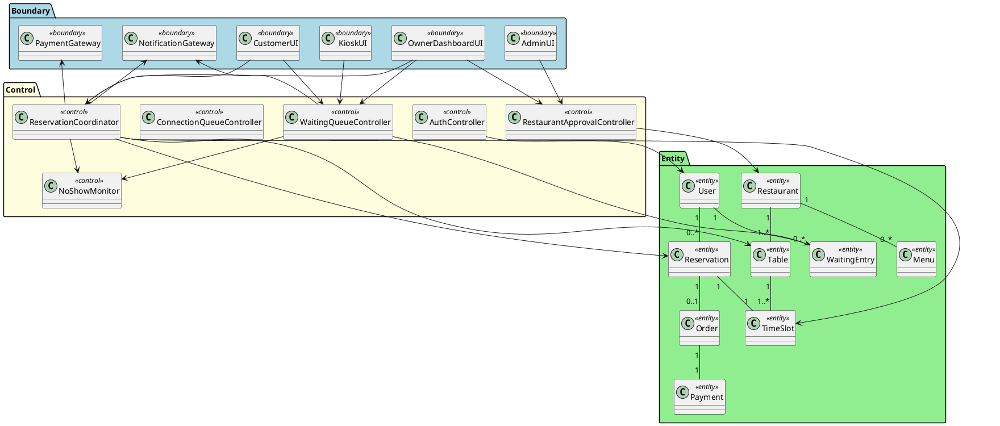

---

## 3. 정적 클래스 다이어그램 (Static Class Diagram)

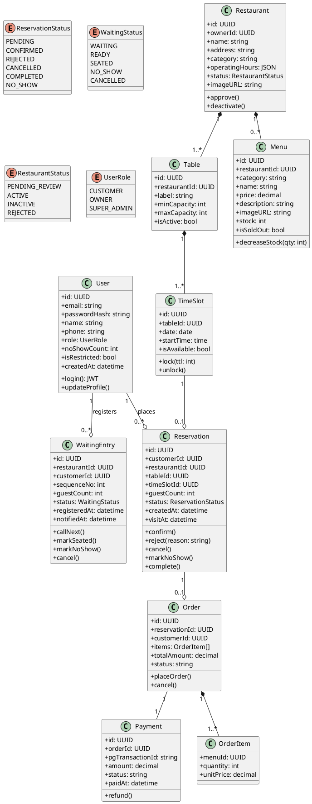

---

## 4. 동적 상호작용 다이어그램 (Sequence Diagrams)

### UC-02: 테이블 예약 신청

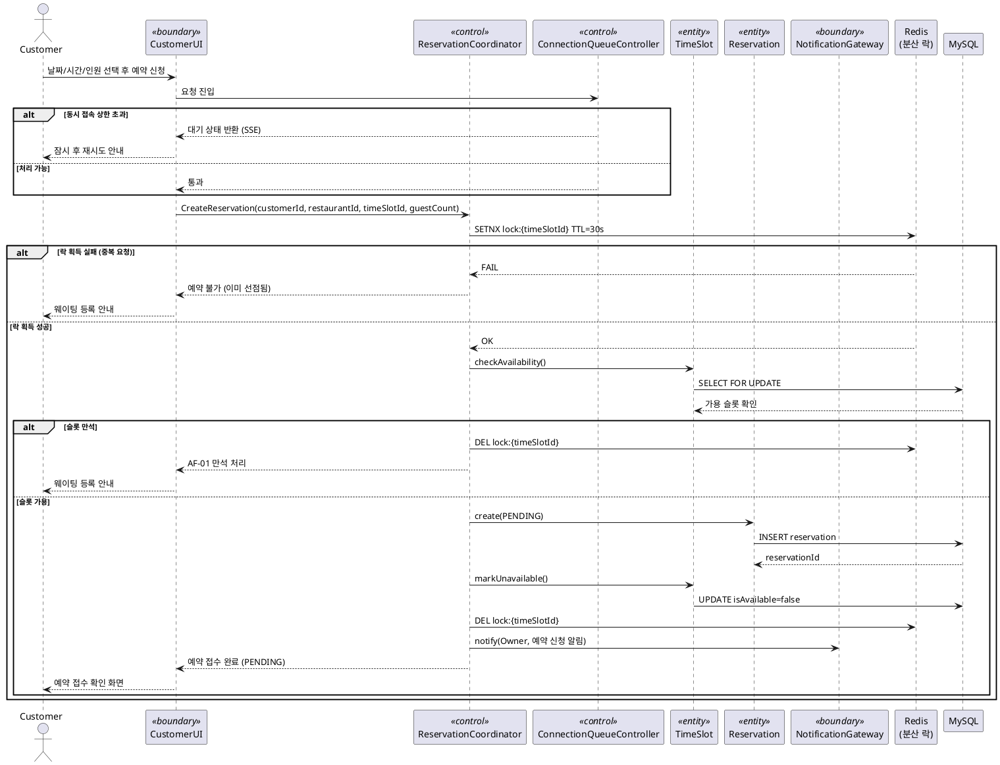

---

### UC-03: 예약 승인/거절

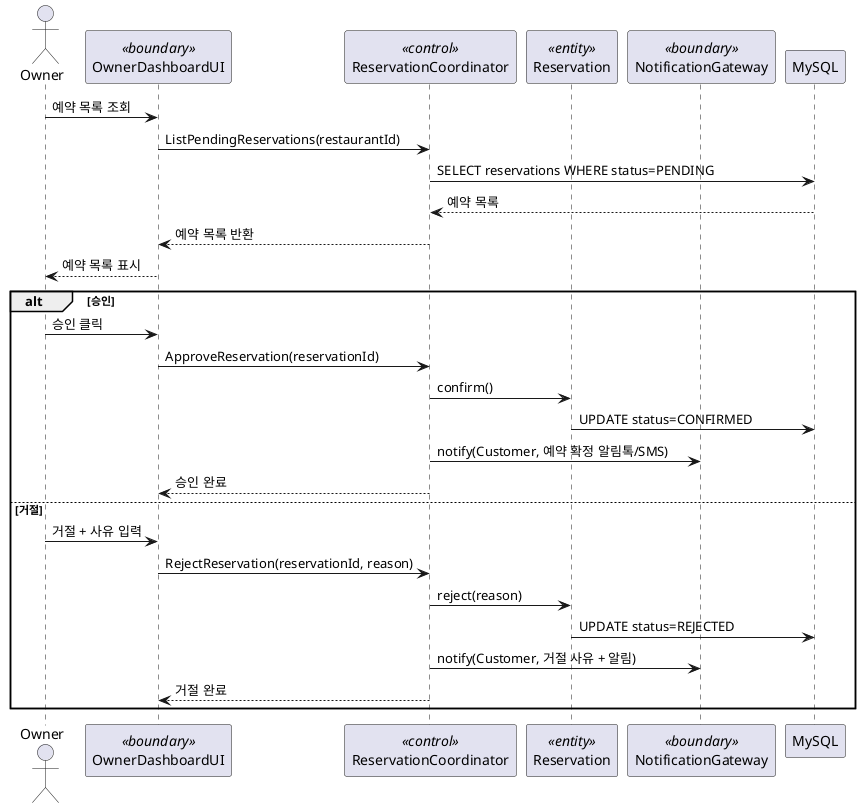

---

### UC-04 / UC-05: 웨이팅 등록 및 입장 처리

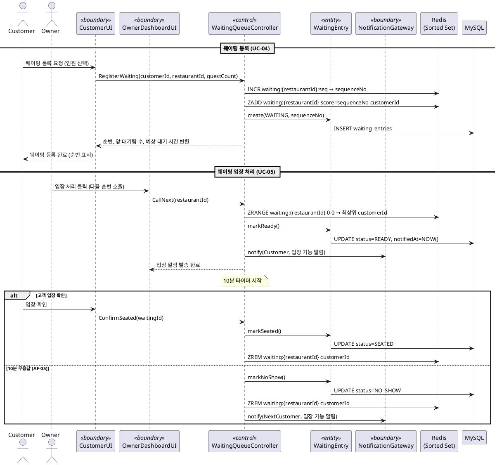

---

### UC-06: 메뉴 사전 주문 및 결제

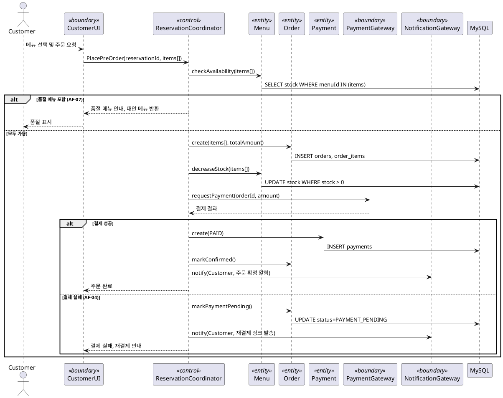

---

## 5. 상태 머신 다이어그램 (State Machine Diagrams)

### 예약 (Reservation) 상태 머신

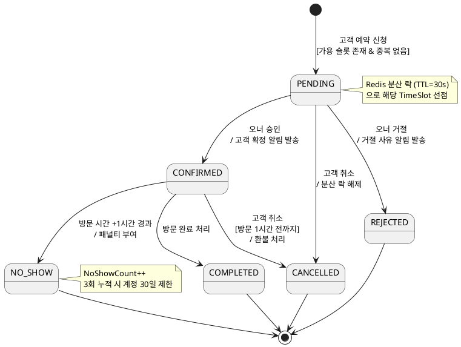

---

### 웨이팅 (WaitingEntry) 상태 머신

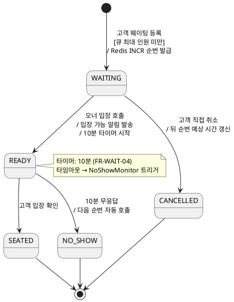

---

### 식당 등록 (Restaurant) 상태 머신

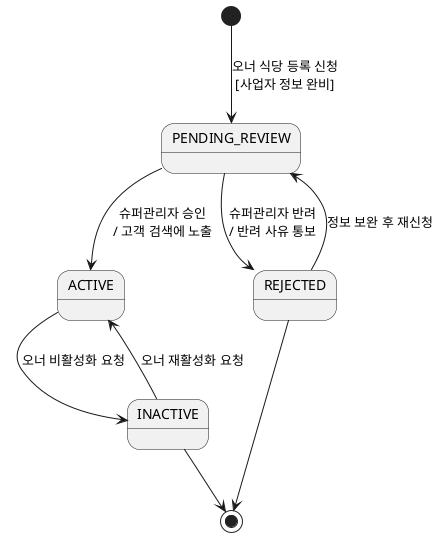

---

## 6. 동시성 설계 (Concurrency Design)

### 임계 영역 및 동시성 제어 요약

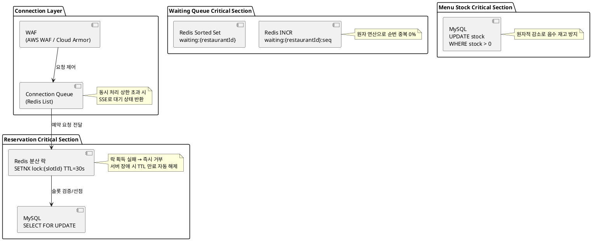

---

## 7. 배포 아키텍처 다이어그램

```plantuml
@startuml deployment
node "Client" {
  component [Browser / Mobile App] as Client
}

node "CDN" {
  component [CloudFront / Cloud CDN] as CDN
}

node "Edge" {
  component [WAF] as WAF
  component [API Gateway\n+ Connection Queue] as APIGW
}

node "Application Cluster (K8s)" {
  component [Next.js\n(SSR)] as NextJS
  component [Envoy Proxy\n(gRPC-Web → gRPC)] as Envoy

  node "gRPC Services" {
    component [UserService\n:50051] as UserSvc
    component [RestaurantService\n:50052] as RestSvc
    component [ReservationService\n:50053] as ResvSvc
    component [WaitingService\n:50054] as WaitSvc
    component [MenuService\n:50055] as MenuSvc
  }

  component [MCP Server\n(dev only)] as MCP
}

node "Data Layer" {
  database "MySQL 8.x\n(Primary + Read Replica)" as MySQL
  database "Redis 7.x\n(Cache / Queue / Lock)" as Redis
  storage "S3 / GCS\n(Images)" as Storage
}

node "External" {
  component [Notification Gateway\n(Kakao / SMS / Email)] as NotifGW
  component [Payment System\n(PG사)] as PaySys
}

Client --> CDN : HTTPS
CDN --> WAF
WAF --> APIGW
APIGW --> NextJS
APIGW --> Envoy : gRPC-Web
Envoy --> UserSvc
Envoy --> RestSvc
Envoy --> ResvSvc
Envoy --> WaitSvc
Envoy --> MenuSvc

UserSvc --> MySQL
RestSvc --> MySQL
ResvSvc --> MySQL
ResvSvc --> Redis
WaitSvc --> Redis
WaitSvc --> MySQL
MenuSvc --> MySQL
MenuSvc --> Storage

ResvSvc --> NotifGW
WaitSvc --> NotifGW
ResvSvc --> PaySys
@enduml
```

---

## 8. COMET 설계 요약

| 설계 단계 | 산출물 | 비고 |
|-----------|--------|------|
| **Use Case Modeling** | UC-01 ~ UC-12 유스케이스 다이어그램 | 9개 기능 + 3개 보조 UC |
| **Object Structuring** | Boundary / Control / Entity 분류 | 6 Boundary, 6 Control, 9 Entity |
| **Static Model** | 클래스 다이어그램 + 상태 열거형 | MySQL 스키마 직접 매핑 |
| **Dynamic Model** | 시퀀스 다이어그램 4종 | UC-02, 03, 04/05, 06 |
| **State Machine** | Reservation / Waiting / Restaurant | 3개 상태 머신 |
| **Concurrency Design** | 임계 영역 식별 및 제어 전략 | Redis 락 + MySQL FOR UPDATE |
| **Deployment** | 배포 아키텍처 | K8s + gRPC 마이크로서비스 |
